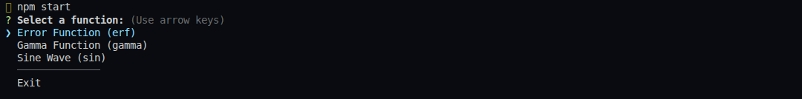
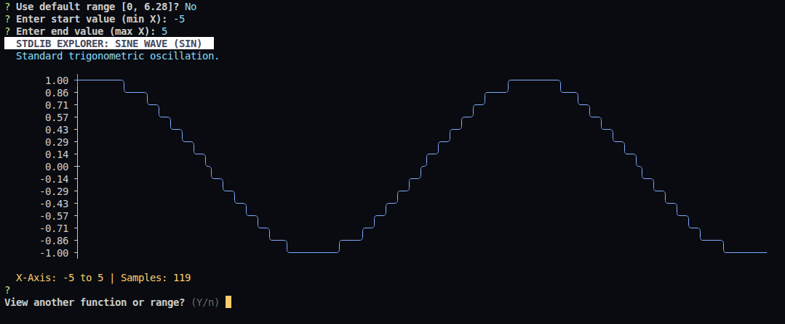
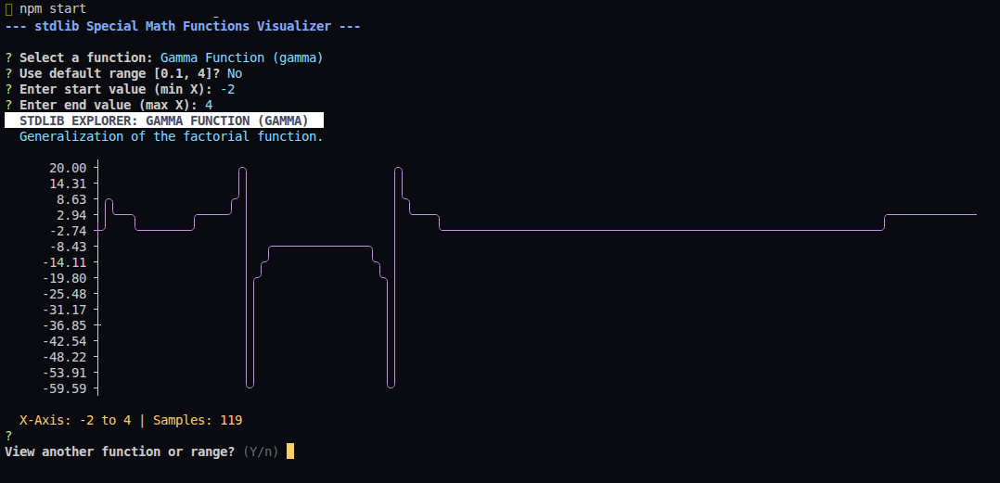

# stdlib CLI Explorer

An interactive CLI tool for visualizing specialized math functions provided by the `stdlib` library.

*Why CLI based?* - because I don't like leaving my terminal.

## Description

This project provides a responsive terminal-based environment to explore complex math functions like the **Gamma Function** and the **Error Function (erf)** *(I intend to add more later)*. It allows users to:

- Select from a list of high-precision math functions.
- Input custom X-axis ranges with built-in validation.
- Visualize data using a responsive ASCII line plot that adapts to the terminal's width and height.
- Navigate through a persistent, interactive menu of functions.

## Visuals
*Menu*


*Plot examples*





## Features

- Adaptive to Terminal size so that the graph does not get distorted.
- uses `stdlib`'s professional math tools for accuracy.
- Custom range inputs from user in the terminal.

## Prerequisites

* **Node.js** (v18.0.0 or higher recommended)
* **npm** (Node Package Manager)
>Note: Any other package manager also works, however this project uses `npm`

## Installation

1. Start by cloning the repository:
```bash
git clone git@github.com:GlyphicGuy/stdlib-cli-explorer.git

[or HTTPS method]
git clone https://github.com/GlyphicGuy/stdlib-cli-explorer.git
```
```
cd stdlib-cli-explorer

```

2. Install the dependencies
```bash
npm install
```

## Usage

Run the following command from the root directory:

```bash
npm start
```
or just use:
```bash
node src/index.js
```

## Built With

* [@stdlib/stdlib](https://stdlib.io/) - High-performance standard library for JavaScript and Node.js.
* [Inquirer.js](https://github.com/SBoudrias/Inquirer.js/) - For the interactive CLI user interface.
* [Asciichart](https://github.com/kroitor/asciichart) - For terminal-based line plotting.
* [Chalk](https://github.com/chalk/chalk) - For terminal string styling.

---